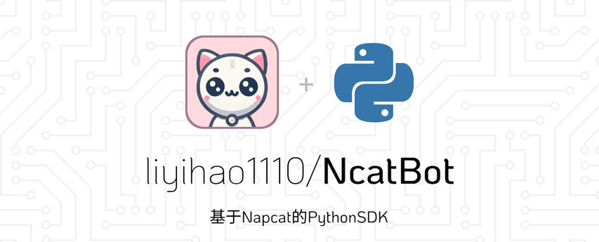
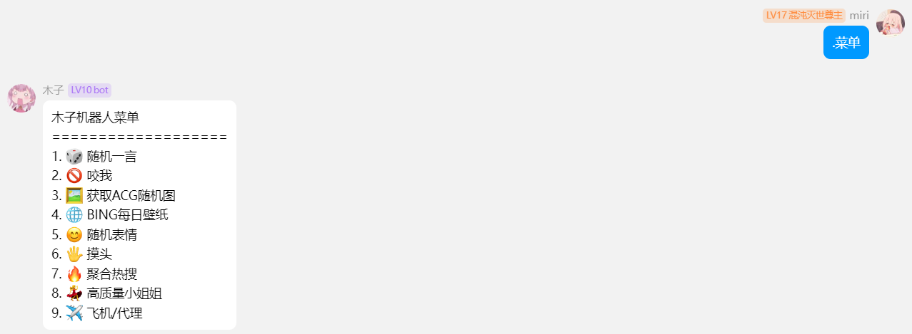

# NcatBot

---

<h4 align="center">基于 NapCat 的 QQ 机器人 Python 快速开发框架 (SDK)</h4>
<p align="center">
    <a href='https://gitee.com/li-yihao0328/nc_bot/stargazers'></img></a>
    <a href='https://gitee.com/li-yihao0328/nc_bot/members'></img></a>
</p>
<p align="center">
	<a href="https://gitee.com/li-yihao0328/nc_bot"></a>
	<a href="https://gitee.com/y_project/RuoYi-Vue/blob/master/LICENSE"></a>
    <a href="https://qm.qq.com/q/CHbzJ2LH4k"></a>
    <a href="https://qm.qq.com/q/S2zIli2qsu"></a>
</p>

NcatBot 是一个开源的基于 **[NapCat](https://github.com/NapNeko/NapCatQQ)** 的 QQ 个人号 Python 库，使用 Python 调用 NTQQ。

使用简单的代码，你就可以完成一个能够处理所有信息的 QQ 机器人。

项目内置了 NapCat 一键启动。

希望这个项目能够帮助你扩展你的个人的 QQ 号、方便自己的生活。

## 更新进度

---
[](https://gitee.com/li-yihao0328/nc_bot)


## 安装

---
可以通过本命令安装 NcatBot：
```commandline
git clone https://gitee.com/li-yihao0328/nc_bot.git
```
## 简单入门实例

---
在开始开发机器人之前，你需要先配置 config.yaml 文件，它可以帮助你自启动 napcat 和项目内部指令。
这是一份配置文件示例，你可以根据你的实际情况进行修改：

```yaml
ws_uri: WEBSOCKET地址,例如:ws://127.0.0.1:3001
hp_uri: HTTP地址,例如:http://127.0.0.1:3000
np_uri: https://github.com/NapNeko/NapCatQQ/releases/download/v4.4.16/NapCat.Shell.zip
bt_uin: 123456 # 机器人 qq 号
token: your token # token, 可以不填
```
当你填写好了 config.yaml 之后，你就可以直接运行以下代码:
```python
from ncatbot.client import BotClient
from ncatbot.logger import get_log

_log = get_log()
bot = BotClient()

bot.run(reload=False)
```
运行后，napcat 将会自启动，并且根据 config.yaml 内的配置对 napcat 进行配置。

有了 NcatBot，运行后你可以使用这些指令：
```python
from ncatbot.client import BotClient
from ncatbot.logger import get_log

_log = get_log()
bot = BotClient()

bot.run(reload=True)# reload=True 表示你不需要运行启动NapCat
```

如果你想要回复发给机器人的文本消息，只需要这样：
```python
from ncatbot.client import BotClient
from ncatbot.message import GroupMessage, PrivateMessage
from ncatbot.logger import get_log

_log = get_log()
bot = BotClient()

@bot.group_event()
async def on_group_message(msg:GroupMessage):
    _log.info(msg)
    if msg.raw_message == "test":
        await bot.api.post_group_msg(group_id=msg.group_id, text="test")

@bot.private_event()
async def on_private_message(msg:PrivateMessage):
    _log.info(msg)
    # 私聊同理

bot.run(reload=True)
```
一些进阶应用可以在下面的开源机器人的源码和进阶应用中看到，或者你也可以阅览[文档](https://docs.ncatbot.xyz/).
## 试一试

---
这是一个基于这一项目的开源小机器人，百闻不如一见，有兴趣可以[进群](https://qm.qq.com/q/L6XGXYqL86)尝试一下。


## 进阶应用

---
**特殊的字典使用方式**

通过打印 NcatBot 的用户以及注册消息的参数，可以发现这些值都是字典。

但实际上 NcatBot 精心构造了群聊和私聊的键值，使得字典的使用更加方便，不过notice和request事件的键值则需要使用字典的键值访问。

群聊和私聊所有的键值都可以通过这一方式访问：
```python
@bot.group_event()
async def on_group_message(msg:GroupMessage):
    # 等价于print(msg["raw_message"])
    print(msg.raw_message)
```
**各类型消息的注册**

NcatBot 支持了 napcat 客户端所有的事件，包括群聊、私聊、通知、请求等。
```python
from ncatbot.client import BotClient
from ncatbot.message import GroupMessage, PrivateMessage

bot = BotClient()

@bot.group_event()
async def on_group_message(msg:GroupMessage):
    print(msg)

@bot.private_event()
async def on_private_message(msg:PrivateMessage):
    print(msg)

@bot.notice_event()
async def on_notice_message(msg):
    print(msg)
@bot.request_event()
async def on_request_message(msg):
    print(msg)

bot.run(reload=True)
```
**各消息类型的注册**
举个例子，例如，如果你想要监听群聊的文本消息，你可以这样注册：
```python
from ncatbot.client import BotClient
from ncatbot.message import GroupMessage
bot = BotClient()

@bot.group_event(["text"])
async def on_group_message(msg:GroupMessage):
    print(msg)

bot.run(reload=True)
```
当你需要监听所有消息类型时，你可以这样注册：
```python
from ncatbot.client import BotClient
from ncatbot.message import GroupMessage
bot = BotClient()

@bot.group_event()
async def on_group_message(msg:GroupMessage):
    print(msg)

bot.run(reload=True)
```
需要注意的是：<mark>只要消息内存在文本，这个消息就会被监听，而不是纯文本才会被监听</mark>

## 如何获取帮助

---
欢迎[进群](https://qm.qq.com/q/L6XGXYqL86)和提 Issue.
## 联系作者

---
作者：[木子](https://gitee.com/li-yihao0328)

邮箱：yihaoli_2002@foxmail.com

## 参与开发

1. 拉取 git 仓库代码

```
git@github.com:liyihao1110/ncatbot.git
```

2. 安装依赖 (推荐使用 Anaconda 管理 Python 环境)

```
pip install -r requirements.txt
```

3. 安装 `pre-commit` 钩子(使用 conda 管理环境)

- 安装 `pre-commit` 包
  **以管理员身份运行终端**, 在 `base` 环境中执行:

  ```
  conda install pre-commit
  ```

-
  **重启终端**, 打开项目环境, 切换到项目根目录, 执行:

  ```
  pre-commit install
  ```

  输出 `pre-commit installed at .git\hooks\pre-commit` 则执行成功.


4. 进行开发

开发完成在 `commit` 时 `pre-commit` 会自动检查代码规范并自动修复绝大部分错误. 如果无法修复则会报错, 需要手动修复. 无论自动或者手动, 修复错误后需要再次 `git add` 和 `git commit`.

**第一次执行 commit 时请打开全局代理(TUN Mode && Global)或设置命令行代理以便拉去 github 上的文件.**

## 贡献者们

---
[liyihao1110](https://github.com/liyihao1110);
[gaojj2000](https://github.com/gaojj2000);
[Isaaczhr](https://github.com/Isaaczhr);
[Fish-LP](https://github.com/Fish-LP);
[huan-yp](https://github.com/huan-yp);

如果你有好的 Idea, 欢迎提 Issue 和 PR!

## 致谢

---
感谢 [NapCat](https://github.com/NapNeko/NapCatQQ).
